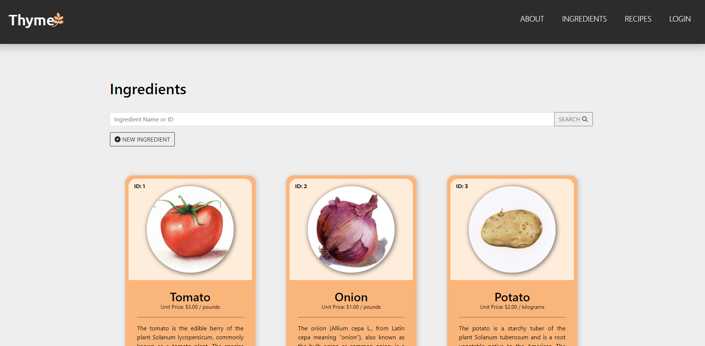

# Thyme: Recipe Manager

Simple recipe manager made with Django, SCSS and Heroku for deployment. Per the requirements for the submission, the user is able to create, update, delete and view both recipes and ingredients. The recipe detail view allows the user to see the cost of each ingredient included in the recipe, as well as the total cost of the recipe.

**The end product can be accessed here**: https://recipe-manager-django.herokuapp.com
